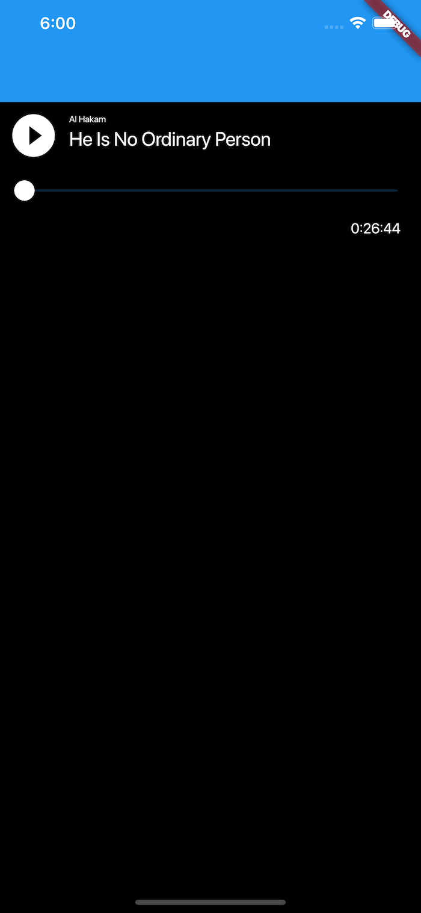
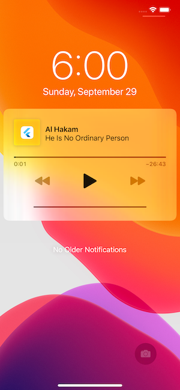

# flutter_playout

AV Playout in Flutter. This plugin provides audio playback with background audio 
support and lock screen controls.

 

 

## Getting Started

### Android
When using this plugin, please make sure you have including a notification icon 
for your project in `drawable` resource directory named `ic_notification_icon`.
This plugin will use this icon to show lock screen controls for playback.

### iOS
Please make sure you've enabled background audio capability for your project.
Please also note that the player might not function properly on a simulator.