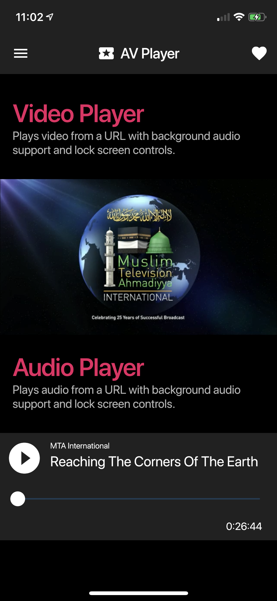
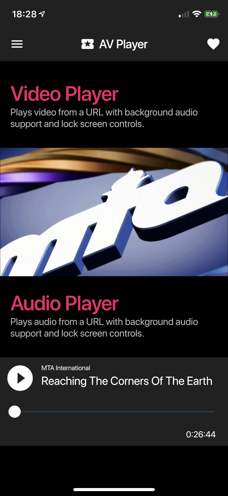
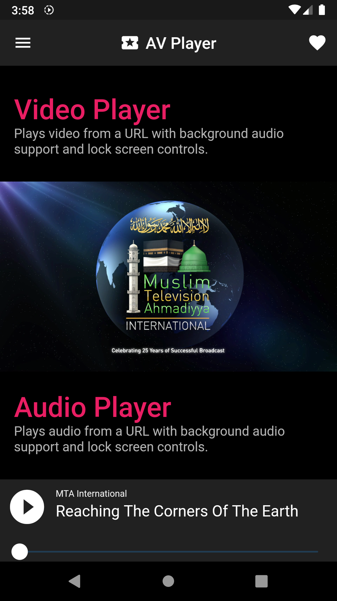
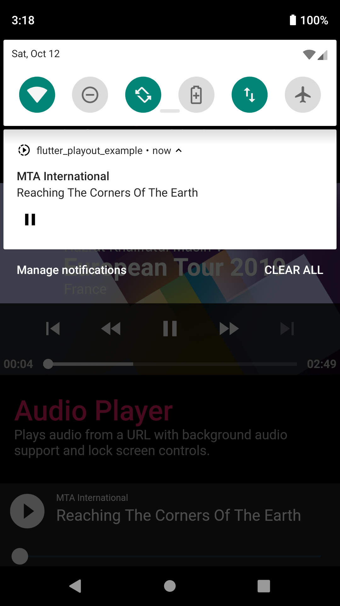

# AVPlayer for Flutter

Audio & Video player in Flutter. This plugin provides audio/video playback with background audio 
support, text tracks and lock screen controls for both iOS & Android. It also provides player events 
such as onPlay, onPause, onTime etc. See example for more details.

* Video supports **HLS** and **Progressive Steaming** for both iOS & Android with multi-audio support.

* Audio supports playback from URL only.

### Apps Using flutter_playout
See below for example of apps using flutter_playout.

1. MTA International ([iOS](https://apps.apple.com/us/app/mta-international/id942619881) - [Android](https://play.google.com/store/apps/details?id=tv.mta.apps.muslimtv))

Send a pull request to list your app here.

#### iOS Example
||||
:---: |:---:| :---:
||

#### Android Example
|||
:---: |:---:
|

## Getting Started

### Android

Uses `ExoPlayer` with `PlatformView` for Video playback and `MediaPlayer` for audio playback.

When using this plugin, please make sure you have included a notification icon 
for your project in `drawable` resource directory named `ic_notification_icon`.
This plugin will use this icon to show lock screen controls for playback.

### iOS

Uses `AVPlayer` with `PlatformView` for video playback and `AVPlayer` with Flutter 
`MethodChannel`s for audio playback.

Please make sure you've enabled background audio capability for your project.
Please also note that the player might not function properly on a simulator.

Opt-in to the embedded views preview by adding a boolean property to the app's 
**Info.plist** file with the key `io.flutter.embedded_views_preview` and the value `YES`.

## HLS MultiAudio Support

Please see example app on how to implement multi-audio for Android. On iOS multi-audio is 
provided natively by the AVPlayer.

## Text Tracks Support

To display subtitles, pass in an array of `TextTrack` sources to the `Video` widget. You
can select a track by providing `preferredTextLanguage` to the `Video` widget with
a language ISO code for example `en` or `fr`. This setup only applies to Android. For iOS
please embed text tracks in the HLS manifest.