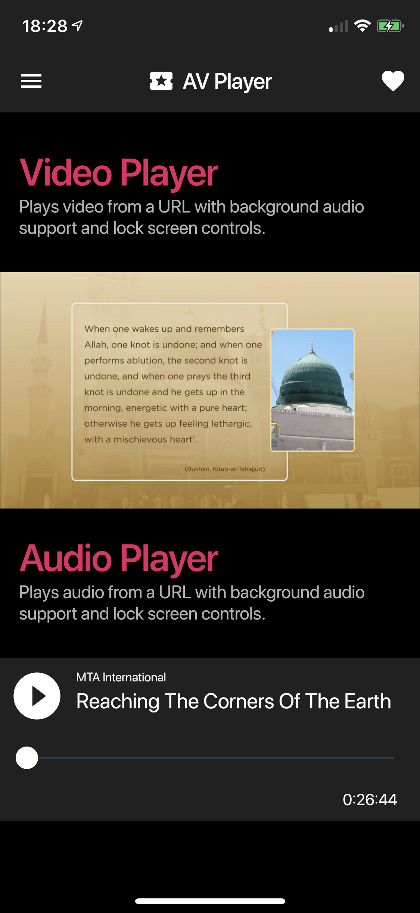

# flutter_playout

AV Playout in Flutter. This plugin provides audio/video playback with background audio 
support and lock screen controls for both iOS & Android.

||||
:---: |:---:| :---:
||
|

## Getting Started

### Android
When using this plugin, please make sure you have included a notification icon 
for your project in `drawable` resource directory named `ic_notification_icon`.
This plugin will use this icon to show lock screen controls for playback.

### iOS
Please make sure you've enabled background audio capability for your project.
Please also note that the player might not function properly on a simulator.

Add following two key/values to your Info.plist.

```
<key>NSAppTransportSecurity</key>
<dict>
    <key>NSAllowsArbitraryLoads</key>
    <true/>
</dict>
```
```
<key>io.flutter.embedded_views_preview</key>
<true/>
```

## TODO

- Implement video playback for Android